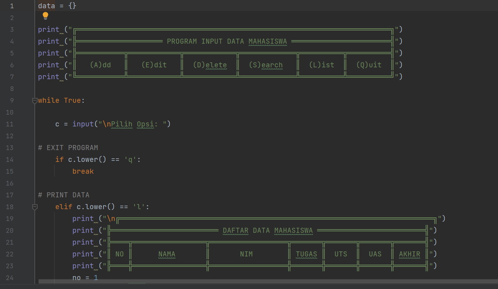
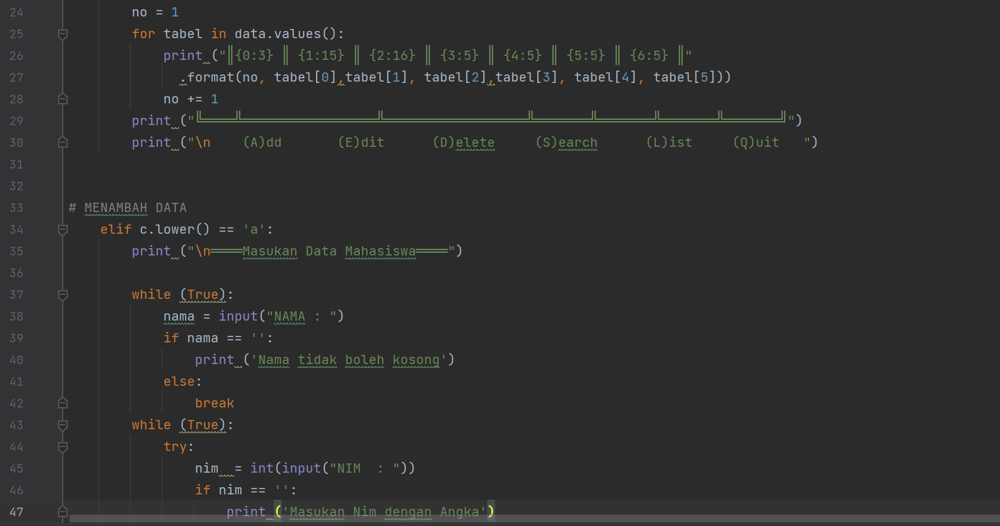
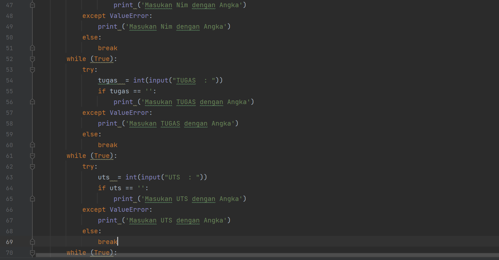
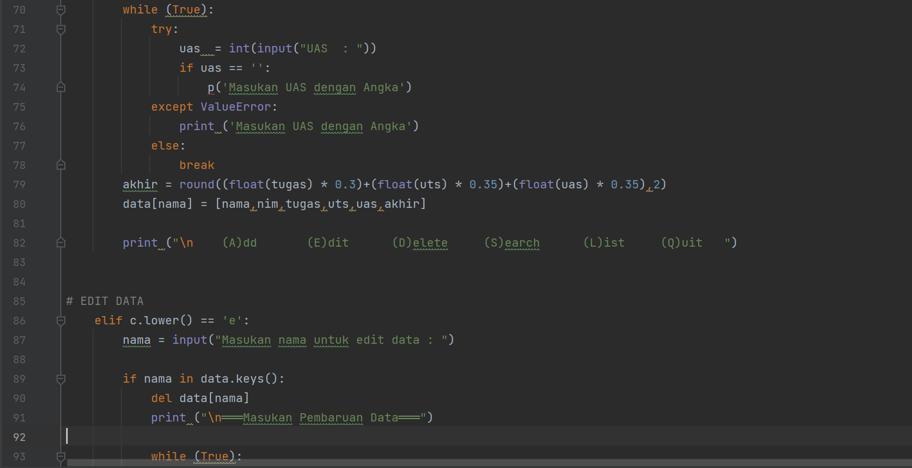
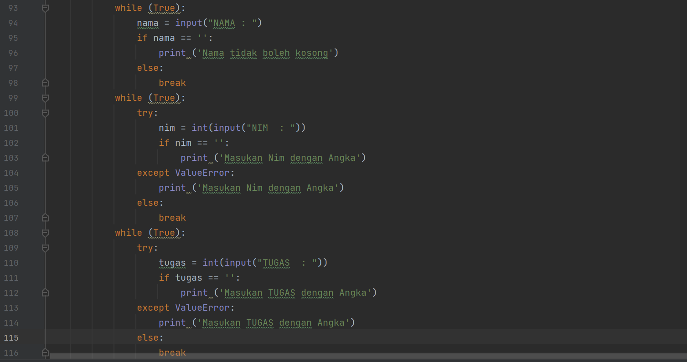
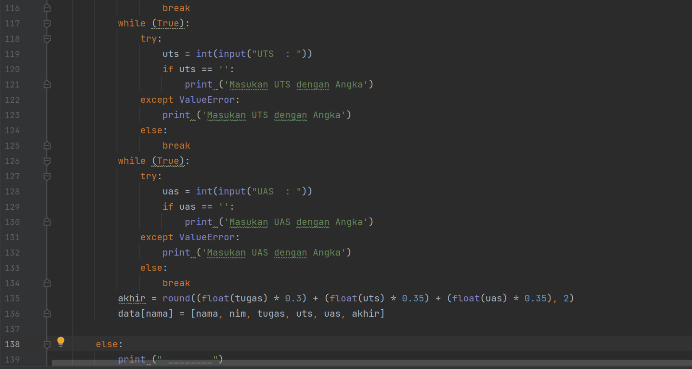
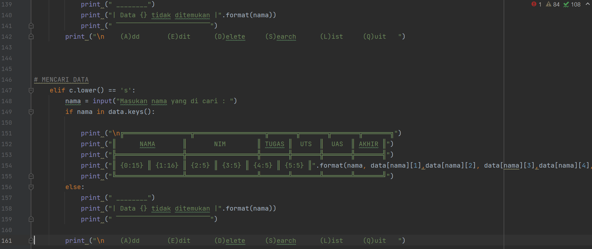
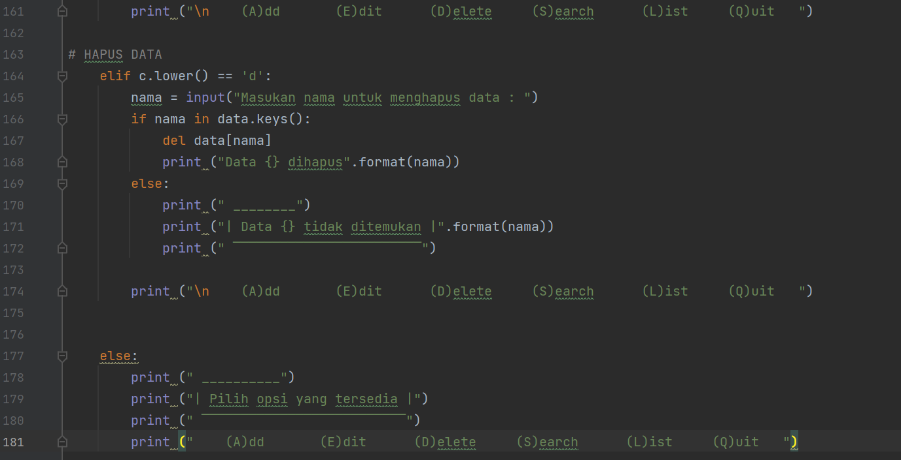
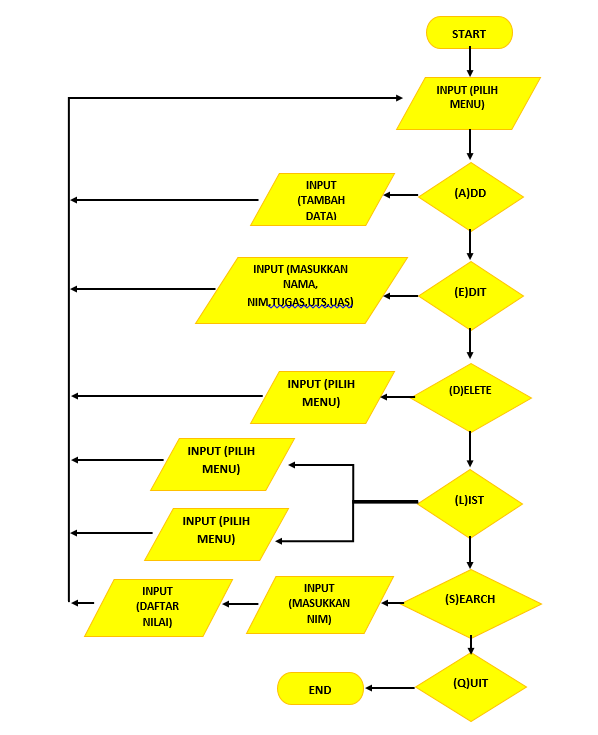
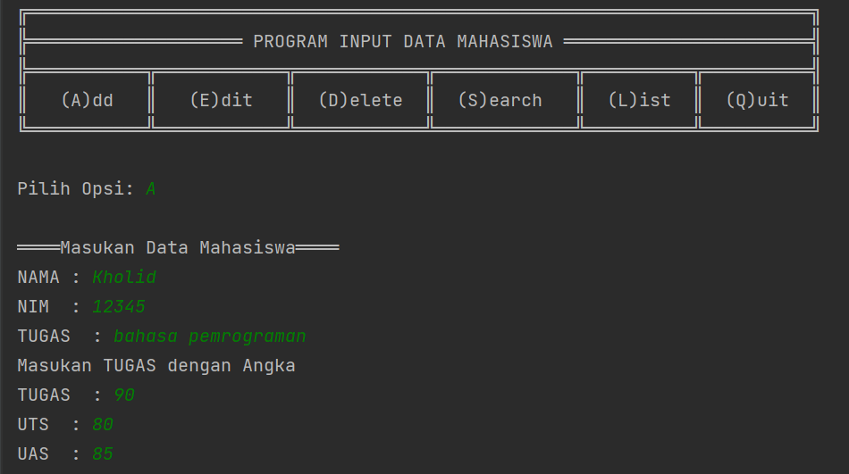

# labpy06
# NAMA : KHOLID WAHYUDI

## Latihan 1

## kode sumber
```Python
import math

def a(x):
    return  x**2
a = lambda x : x**2
print(a(2))
def b(x, y):
        return math.sqrt(x**2 + y**2)

b = lambda x, y : x ** 2 + y ** 2
print(b(2, 2))
def c(*args):
        return sum(args)/len(args)

c = lambda *args : sum(args)/len(args)
print(c(1,2,3,4,5))
def d(s):
        return "".join(set(s))

d = lambda s: "".join(set(s))
print(d("TUGAS"))
```

## Output
.png)
## Tugas praktikum
## PROGRAM
<p>		Dibawah ini adalah program sederhana untuk membuat daftar Nilai Mahasiswa dengan menggunakan <b>Kamus</b>, dengan Menu <i>Tambah(Add), Ubah(Edit), Hapus(Delete), Cari(Search), dan lihat(List)</i>
</p>










## FLOW CHART
Berikut tampilan dari Flow Chart :


## Penjelasan
- data = {} mendaklarasikan dictionary kosong
- Lalu buat perulangan untuk menginisialisasikan penambahan menu pilihan (A)dd,(E)dit,(D)elete,(S)earch,(L)ist, dan (Q)uit.
```Python
while True:
	x = input("(A)dd, (E)dit, (D)elete, (S)earch, (L)ist, (Q)uit: ")
```
## Menambahkan Data
- Berikut adalah syntax untuk menambakan data dengan ketentuan jika kita mengetik `A` maka program akan melakukan penambahan data dan ditampung dalam directori data yang telah kita buat, dengan nama sebagai keys dan yang lain sebagai nilai.
```Python
if x.lower() == 'a':
        print("Tambah Data")
        nama = input("Nama           : ")
        nim = int(input("NIM            : "))
        uts = int(input("Nilai UTS      : "))
        uas = int(input("Nilai UAS      : "))
        tugas = int(input("Nilai Tugas    : "))
        n_akhir = tugas * 0.30 + uts * 0.35 + uas * 0.35
        data[nama] = nim, uts, uas, tugas, n_akhir
```
## Mengubah Data
```Python
elif x.lower() == 'e':
    print("Ubah Data")
    nama = input("Masukkan Nama   : ")
    if nama in data.keys():
        nim = int(input("NIM            : "))
        uts = int(input("Nilai UTS      : "))
        uas = int(input("Nilai UAS      : "))
        tugas = int(input("Nilai Tugas    : "))
        n_akhir = tugas*0.30 + uts*0.35 + uas*0.35
        data[nama] = nim, uts, uas, tugas, n_akhir
    else:
        print("Nama{0} Tidak Ditemukan".format(nama))
```
## Menghapus Data
- Sama seperti mengubah data yang dipilih.
- Data yang dihapus adalah data yang di input dalam variabel nama dimana berisi (string) yang mewakili NIM, Nilai Tugas, UTS, UAS.
```Python
    elif x.lower() == 'd':
        print("Hapus Data")
        nama = input("Masukkan Nama  : ")
        if nama in data.keys():
            del data[nama]
        else:
            print("Nama {0} Tidak Ditemukan".format(nama))
```
## Mencari Data
- Perbandingan untuk mencari data yang akan diubah sama seperti cara mengubah data, hanya saja perintah ini digunakan untuk menampilkan data yang di input berdasarkan `nama`. Berikut kode yang digunakan.
```Python
elif x.lower() == 's':
    print("Cari Data")
    nama = input("Masukkan Nama : ")
    if nama in data.keys():
        print("=" * 73)
        print(
            "|                             Daftar Mahasiswa                          |")
        print("=" * 73)
        print(
            "| Nama            |       NIM       |  UTS  |  UAS  |  Tugas  |  Akhir  |")
        print("=" * 73)
        print("| {0:15s} | {1:15d} | {2:5d} | {3:5d} | {4:7d} | {5:7.2f} |"
              .format(nama, nim, uts, uas, tugas, n_akhir))
        print("=" * 73)
    else:
        print("Nama {0} Tidak Ditemukan".format(nama))
```
## Melihat Data
- Selanjutnya adalah kode yang digunakan untuk melihat input yang sudah dimasukkan.
- Data dalam perulangan for di ambil dari variabel Dictionary data pada bagian value yang berbntuk list. variabel `i = 0` digunakan untuk membuat nomer. Data yang akan ditambilkan adalah Nama, NIM, Nilai Tugas, UTS, UAS dan Nilai Akhir
```Python
elif x.lower() == 'l':
    if data.items():
        print("=" * 78)
        print(
            "|                               Daftar Mahasiswa                             |")
        print("=" * 78)
        print(
            "|No. | Nama            |       NIM       |  UTS  |  UAS  |  Tugas  |  Akhir  |")
        print("=" * 78)
        i = 0
        for y in data.items():
            i += 1
            print("| {no:2d} | {0:15s} | {1:15d} | {2:5d} | {3:5d} | {4:7d} | {5:7.2f} |"
                  .format(y[0][:13], y[1][0], y[1][1], y[1][2], y[1][3], y[1][4], no=i))
            print("=" * 78)
    else:
        print("=" * 78)
        print(
            "|                               Daftar Mahasiswa                             |")
        print("=" * 78)
        print(
            "|No. | Nama            |       NIM       |  UTS  |  UAS  |  Tugas  |  Akhir  |")
        print("=" * 78)
        print(
            "|                                TIDAK ADA DATA                              |")
        print("=" * 78)
```
## Keluar
Perulangan diatas adalah perulangan yang akan berjalan terus menerus dan akan berhenti jika kode berikut di eksekusi ``` elif x.lower() == 'q': ```
- Jika `Q` di input dan `lower()` digunakan untuk mengkonversi input yang dimasukkan ke bentuk lower case dan input `Q` digunakan berdasarkan perintah yang sudah dimasukan dalam keterangan pada fungsi input dibawah ini:
```Python  
elif x.lower() == 'q':
        break

    else:
        print("Pilih Menu Yang Tersedia")
```
## Hasil Output
Apabila program dijalankan maka akan menghasilkan output sebagai berikut :

- Menambahkan Data dengan input `A` dan melihat data dengan input `L`

.png)
- Mengubah Data dengan input `E` dan melihat data dengan input `L`
.png)
- Menghapus Data dengan input `D` dan melihat data dengan input `L`
.png)
- Mencari Data dengan input `S`
.png)
- Keluar dari program dengan input `Q`
.png)


<h1>THANK YOU</h1>